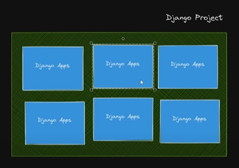

# utilizaremos virtualenv para tener un entorno virtual para desarrollar proyectos con Django
- -- virtualenv venv -- y con este comando ya tendria mi entorno virtual
# ahora tendremos que activar nuestro entorno virtual para esto haremos lo siguiente
- .\venv\Scripts\activate - aqui basicamente accedemos a la ruta al archivo activate para ejecutarlo y con esto ya activamos nuestro entorno virtual
# una vez tengo mi entorno virtual instalare el framework django para trabajar
- --pip install django--
# si deseas verificar que tienes instalado django puedes usar el siguiente comando
-django-admin --version--
# ahora lo que vamos a hacer es utilizar django para crear un proyecto
- --django-admin startproject mysite . -- es recomendable que al colocar el nombre del proyecto no coloques python, django o test por que podria interferir con carpetas o archivos del framework
#ahora vamos a estar ejecutando el archivo manage.py el archivo manage.py nos sirve para ejecutar comando de administracion ejemplos seria correr un servidor, abrir un shell, copiar archivos o optimizar nuestra app
# para poder ejecutar ejecutar un servidor usaremos el siguiente comando que es 
- -- python manage.py runserver-- si quieres correr en otro puerto puedes utilizar
- -- python manage.py runserver 30000-- con esto correremos el server en otro puerto
----------------------------------------------------------------------------------------------------
# vamos a ver la estructura que de carpeta y archivos que creo django
- El archivo --init--.py es un archivo solo sirve para decirle a django que la carpeta my site es un modulo de python
- Tambien tenemos un carpeta __pycache__ que solo guarda codigo que ya compilo python para que se ejecute mas rapido
- El archivo setting es para que nosotros podamos configurar todo el proyecto este archivo tiene muchas variables pero los que mas no van a importar son las variables ALLOWED_HOSTS = , tambien tenemos una variable DEBUG(que es para decirle a nuestro app que estamos en modo desarrollo o en modo produccion este debug nos permite tener mas informacion ), despues tenemos un variable SECRET_KEY( esto nos sirve para que django lo utilice un forma mejorar la encryptacion del usuarios o poder generar datos que puede compartir el navegador o el servidor), despues tenemos la variable BASE_DIR(no sirve para indicar los directorios que tienen los proyectos)--- teoria django nos permite dividir el proyecto en aplicaciones ejemplo podemos tener una aplicacion de navegaciones, una aplicacion de busqueda , etc. Tambien tenemos una variable DATARABES(este nos permite usar una base de datos por defecto ya trae una), tambien tenemos como validar contraseñas al momento que se autentifique los usuarios,
tambien tenemos las variables STATIC_URL(aca basicamente irian los archivos estaticos que son los html)
- El archivo urls.py nos permite escribir las url que los usuarios pueden visitar
- El archivo asgi.py y wsgi nos permite servir contenido
--------------------------------------------------------------------------------------------
# Aplicaciones con django
 en django podemos conformar multiples partes que jango las llaman app ejemplo 
  
- para poder crear aplicaciones utlizaremos el siguiente comando en este ejemplo supongamos que nuestro proyecto va a tener una aplicacion llamada blog(** --python manage.py startapp blog **) con esto nos aparecera una carpeta blog con este comando crearemos carpetas para poder crear aplicaciones en donde se acoplaran al proyecto en la carpeta mysite que es el nucleo del proyecto
# Descripcion de los archivos de una aplicacion
- El archivo view es un archivo principal el motivo es que ahi vamos a poder definir los archivos que vamos a enviar al cliente para que pueda visualizar en otras palabras vamos a enviar los archivos html
- Tambien tenemos una carpeta migrations esa carpeta se va a llenar cuando toquemos la base de datos, djanfo trae un orm por defecto lo que nos va a ayudar a las consultas sql, tambien podemos utilizar archivos sql
- El archivo admin este archivo es para que nosotros podamos añadir nuestras aplicaciones a algo llamado panel de administrador esto nos va a poder administrar nuestras aplicaciones es decir vamops a poder crear datos, crear usuarios, si un usuario le pertenece un rol vamos a poder actualizar, etc
- Luego tenemos un archivo app.py esto seria equivalente como el archivo settings.py del proyecto pero app.py solo seria para la seccion de la aplicacion
- Luego tenemos el achivo models aca vamos a poder crear clases para poder crear tablas en sql- basicamente lo va a guardar en la carpeta migrations
- tambien tenemos archivo de test para poder testear los acrhivos logica, etc
# Vamos a ver como podemos crear nuestro propio hola mundoo
- nos vamos a la carpeta que se genero cuando creamos una aplicacion este archivo es views.py en este archivo vamos a crear una funcion
- quiero resaltar algo para poder importar modulos en python podemos import de la siguente manera-> from myapp.view from hello(de la carpeta myapp al archivo view importame la funcion hello) otra forma seria -> from myapp from view(de la carpeta myapp importame todo el archivo view)
# Vamos a aprender base de datos
- Cuando creamos un proyecto utilizando django deberemos hacer un creacion de la base de datos, crearemos las tablas, crearemos los usuarios, entonces deberemos hacer las migraciones, para hacer esto debemos ejecutar comandos
- crear migraciones python manage.py makemigrations
- ejecutar migraciones python manage.py migrate y este comando python manage.py makemigrations nos permite agregar los cambios que le hicimos al modelo
- Deberemos crear un archivo model en la app donde crearemos clases que herenden del modulo models y ahi crearemos atributos para los campos de nuestra tabla, despues nos vamos a la carpeta de nuestro proyecto principal y vamos a buscar el archivo settings.py en la variable INSTALLER_APPS, esta seccion nos permite poder conectar nuestro proyecto  principal con la app nueva, dentro del arreglo debemos colocar el nombre de nuestra aplicacion, luego de agregar nuestra app, debemos hacer las migraciones de las aplicaciones con el comando  --python manage.py makemigrations my app-- una vez ejecutado las migraciones podras entrar en la carpeta de tu app donde realizaste la migracion en la carpeta migrations veras archivos de la compilacion que acabaste de hacer, lugo debemos ejecutar las migraciones con el comando --python manage.py migrate--, con esto podras visualizar la creacion de la tabla,para visualizar utilidar un programa para visualizar
-si quieres cambiar de base de datos lo mas recomendable es que revises la documentacion en django databases ahi podras visualizar de como hacer para poder cambiar
# Vamos a ver como poder interactuar con las tablas que creamos
- Importamos las clases de los modelos
from myapp.models import Project, Task
p = Project(name="aplicacion movil") insertamos datos en las propiedades de la clase e instanciamos
p.save() guardamos los datos por ende se va a insertar datos en nuestar tabla
- Listar los datos
data = Project.objects.all() nos mostrara todos los datos de la tabla
dataSpecif = Project.objects.get(id = 1)  nos traera un registro con el id = 1
- Traer datos en una tabla con clave foranea
p = Project.objects.get(id=1)
p.task_set.all() traeme todos los registros en donde de tareas en donde tengan el registro con la id = 1
- Creamos un registro con clave foranea
p = Project.objects.get(id=1)
p.task_set.create(title = "descargar IDE") con esto agregamos una tarea con el projecto con id = 1
- Traerme todos los datos de las tablas con claves foraneas o relacionadas
p = Project.objects.get(id=1)
p.task_set.all() obtengo todos los registros de la tabla con relaciones
p.task_set.get(id=1) obtengo un unico valor
y si no existe te arroja un error
si vos queres que te devuelva un valor vacio o null es recomnedable usar un filter
# Usar el admin para administra nuestros projecto
- Vamos a usar un comando para crear un usuario y asi loguearnos-- python manage.py createsuperuser--
- Para agregar nuestros modelos al gestionador admin que nos ofrece django debemos ir a la carpeta de nuestra app al archivo admin y agregar nuestros modelos al sitio 
# motor templates para crear interfaces
- django utiliza jinja- tecomiendo leer la documentacion cuando necesites aplicar codigo en el html 